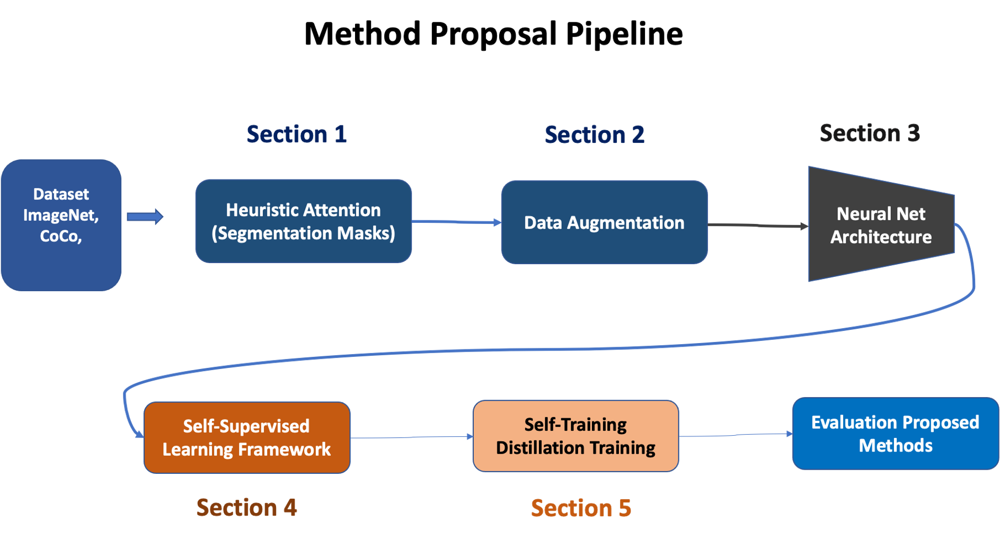

# Heuristic_attention_represenation_learning_ssl

## First Checkout Guideline for Contribution

Awesome! Building this project, See [ Guidelines](contribution_guideline.md).

## Our Project Structure 

1. **SECTION 1**  Huristic Mask Proposal Methods 

+ Implementation on Classical ML Methods **/Heuristic_Segmentation/Classical_ML_methods/**

Detail of implementation (FH, MCG,FastMCG, DRFI ) 

+ Implementation on Deep Learning Methods **/Heuristic_Segmentation/Deeplearning_methods/**

Detail of implementation (DeepMask, DeepLabV3, others ) 
