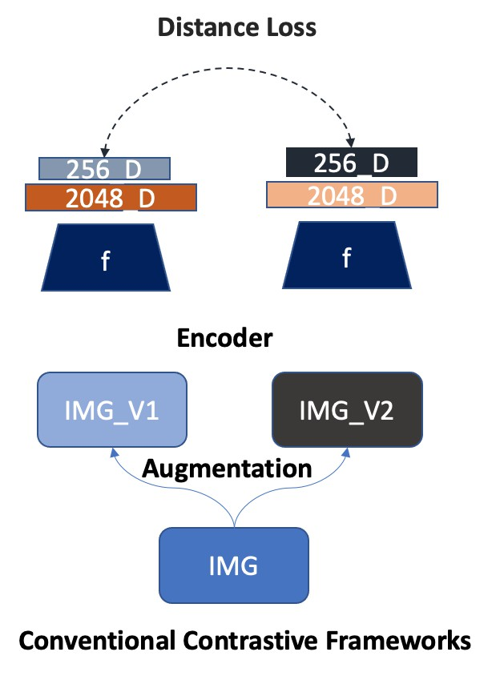
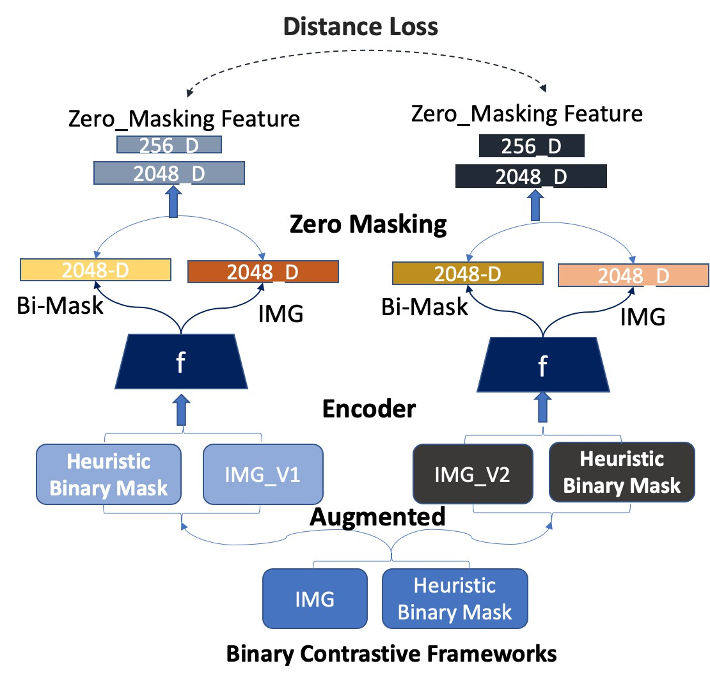
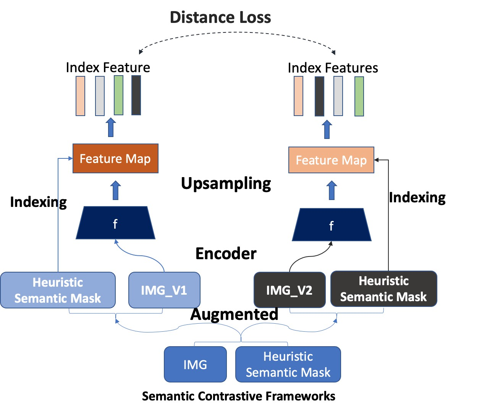

# Heuristic_attention_represenation_learning_ssl

## First Checkout Guideline for Contribution

Awesome! Building this project, See [ Guidelines](contribution_guideline.md).

## List Important Self-Supervised Literature Reviews

## Our Project Structure 

### 1. **SECTION 1  Huristic Mask Proposal Methods** 

+ Implementation on Classical ML Methods **/Heuristic_Segmentation/Classical_ML_methods/**

Detail of implementation (FH, MCG,FastMCG, DRFI ) 

+ Implementation on Deep Learning Methods **/Heuristic_Segmentation/Deeplearning_methods/**

Detail of implementation (DeepMask, DeepLabV3, others ) 

### 2. **SECTION 2  Implement DataAugmentation Two Views and Multi-Views** 

+ Standard Implement SimCLR + BYOL Augmentation strategy
GoogleColab Notebook Implementation [SimCLR_Augmentation](https://colab.research.google.com/drive/1Xsh3O8NYxUcUcBy3avJbqrWcpcg-6uid?authuser=2)

+ Implementation Multi-View Augmentation Strategy SwAV (Global + Local Views)

### 3. **SECTION 3 Neural Net Architecture**
+ Under Development

### 4. **SECTION 4 Multi-Objectives Self-Superivsed Framework**

+ Heuristic Attention Contrastive frameworks Implementation Include three different approaches 

+ Conventional Contrastive Framework

 {:height="25%" width="25%"}

+ Binary Contrastive Framework based on binary segmentation mask

 {:height="25%" width="25%"}

+ Semantic Contrastive Framework based on Semantic segmentation mask

 {:height="25%" width="25%"}

+ Conventional Contrastive Framework

+ Binary Contrastive Framework based on binary segmentation mask

+ Semantic Contrastive Framework based on Semantic segmentation mask

